# Food Test Module and DB 🍽️

## Description

This project is designed for **learning** how to work with databases, API requests, Webpack, JSON-server, and MAMP. It provides a simple food-related interface that interacts with a mock database.

This is a learning project where I have gained experience in:

* Setting up and configuring Webpack 📦
* Working with JSON-server for mock APIs 🌐
* Using MAMP for local PHP development 🐘
* Managing dependencies with npm 📦
* Making API requests and handling responses 🔄
* Structuring JavaScript code for better maintainability 🏗️

## Technologies

* HTML, CSS, JavaScript – *front-end structure and styling* 🎨
* Webpack – module bundler 📦
* JSON-server – mock database API 🌐
* MAMP – local PHP server 🐘
* Node.js & npm – package management 📦

## Installation

### Prerequisites

Ensure you have the following installed on your system:

* Node.js 🟢
* MAMP 🐘
* npm (comes with Node.js) 📦

### Installing Webpack

Install Webpack and Webpack CLI globally:

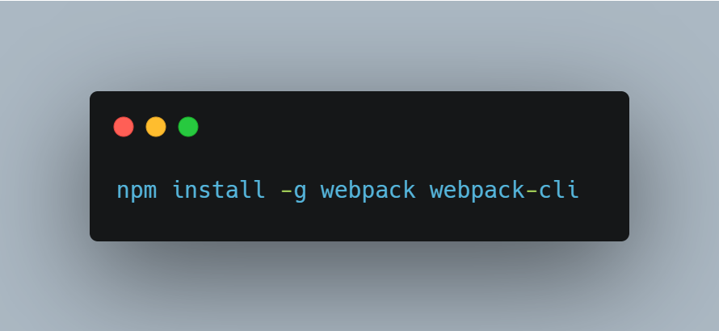

Or install Webpack locally in the project:

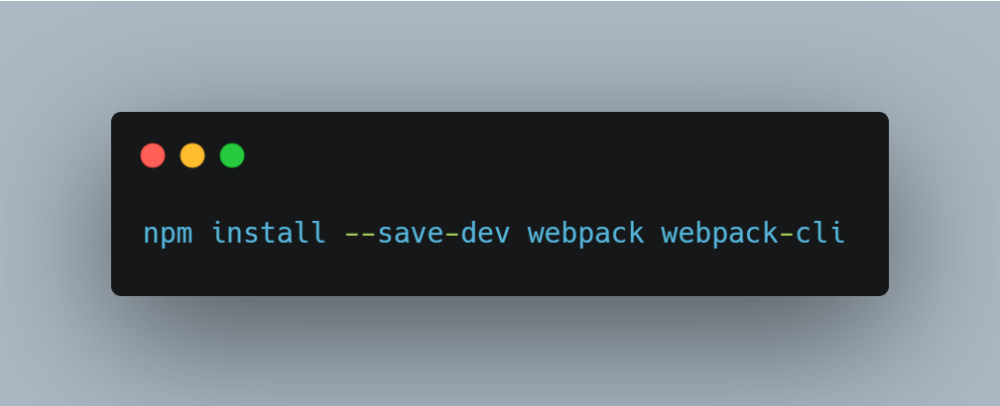

### Steps

1.  Clone the repository:

    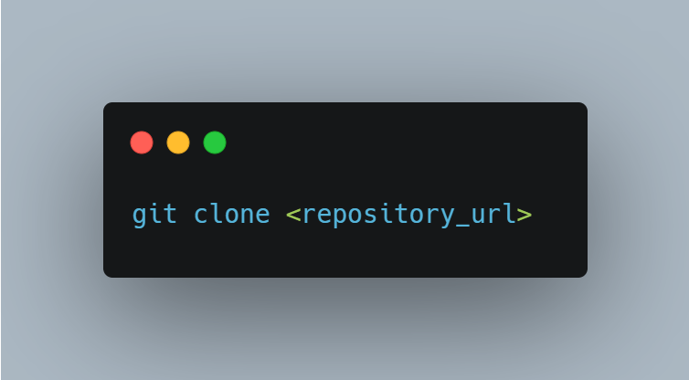

2.  Navigate to the project directory:

    

3.  Install dependencies:

    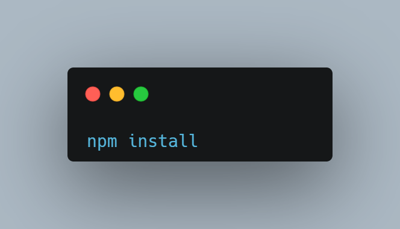

## Running the Project

### Start Webpack Development Server

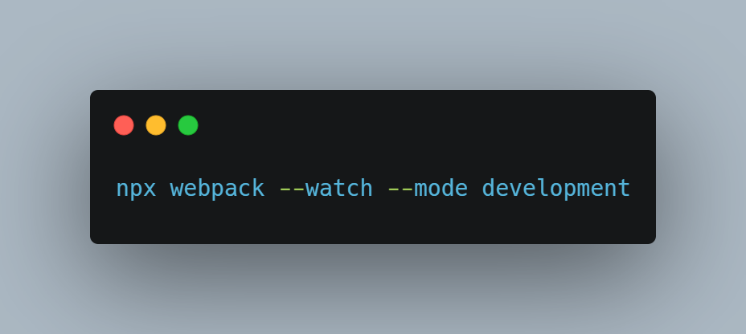

This will start Webpack in watch mode to automatically rebuild changes.

### Start Webpack on a Specific Port (default 8080 or set your own)

### Start JSON-server (default port 4000 or set your own)

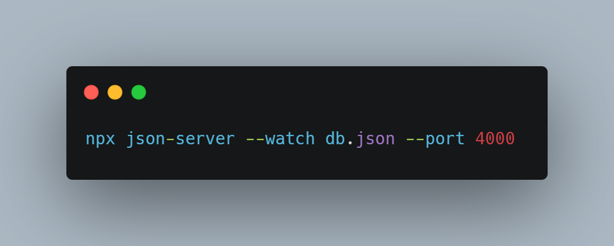

This will create a mock API at `http://localhost:4000`.

### Start MAMP (for PHP Server)

1.  Open MAMP and start the Apache server.
2.  Move the project folder to the MAMP `htdocs` directory.
3.  Access `http://localhost/Food-test-module-and-DB-main/server.php`.

## API Endpoints

* Get all food items:

    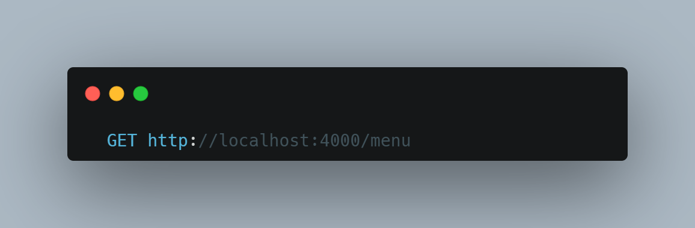

* Add a new food item:

    

* Update a food item:

    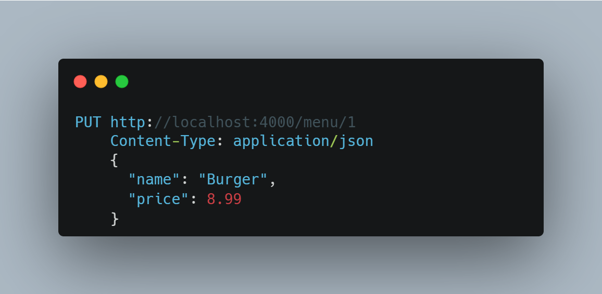

* Delete a food item:

    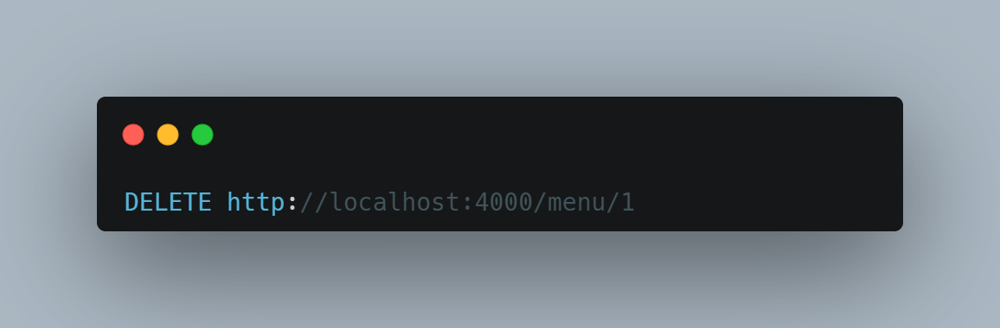

## Common Issues & Fixes

### JSON-server not starting

* Error: `Error: listen EADDRINUSE: address already in use 4000`
* Solution: run:

    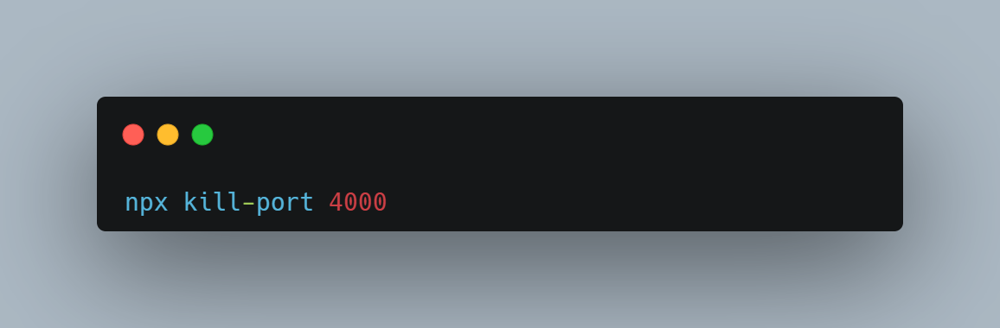

    and restart the server.

### Webpack not bundling

* Solution: ensure Webpack is installed, and try:

    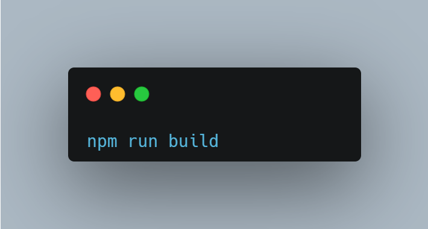

## Future Improvements 🚀

* Integrate a real database (e.g., MongoDB, MySQL) 🗄️
* Add authentication 🔐
* Improve the user interface with a front-end framework (React, Vue) ⚛️
* Implement sorting and filtering for food items 🔍
* Enhance error handling and API validation ⚠️
* Optimize Webpack configuration for better performance ⚡

Now you can run the project and experiment with databases, API requests, and Webpack! 🎉
